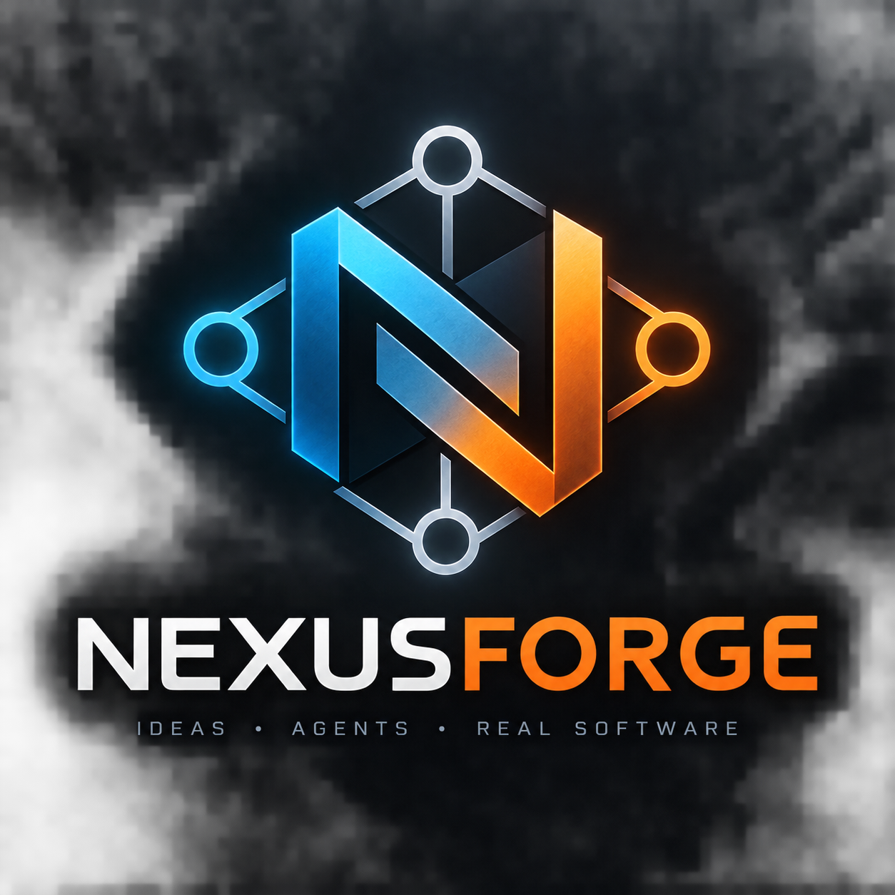

# NexusForge

<p align="center">
  
</p>

NexusForge is a local OpenCode environment for running several specialized
language models on consumer hardware. The current setup targets an NVIDIA GPU
with 8 GB VRAM and uses llama.cpp as an OpenAI-compatible inference server.

The llama.cpp router keeps at most one model in VRAM. OpenCode can therefore
retain one conversation while switching between coding, reasoning, and
long-context models.

## Repository layout

```text
NexusForge/
├── installations/       model, llama.cpp, and OpenCode installers
├── serving/             router and standalone serving scripts
├── config/              llama.cpp router and long-context settings
├── models/              downloaded GGUF models
├── llama.cpp/           local llama.cpp checkout and build
├── .opencode/
│   ├── plugins/         switch_model plugin
│   ├── skills/          OpenCode skills
│   └── tests/           plugin tests
├── opencode.json        local provider and model definitions
└── opencode.sh          project-local OpenCode launcher with Exa enabled
```

Installation and serving scripts resolve the repository root from their own
location. They can therefore be invoked through an absolute path or from the
repository root without depending on the current working directory.

## Models

| Model | OpenCode ID | Context | Intended use |
|---|---|---:|---|
| Qwen3.5 9B | `llama-main/qwen3.5-9b-orchestrator` | 16K | default orchestrator |
| Ornith 1.5 9B | `llama-ornith/ornith-1.5-9b-orchestrator` | 128K | long-context reasoning orchestrator |
| Granite 4.2 8B | `llama-granite/granite-4.2-8b-orchestrator` | 16K | optional orchestrator |
| Qwen3.5 4B | `llama-long/qwen3.5-4b-long-context` | 512K | subagent-only large-source extraction |
| Granite 4.2 3B | `llama-granite/granite-4.2-3b-multi` | 32K per slot | subagent-only parallel implementation |

The role suffixes are intentional: `-orchestrator` models own planning and
integration, `-long-context` is used for large-source extraction, and `-multi`
models execute small bounded tasks. Granite 3B uses three 32K subagent slots by
default and is never selected as the primary-session model.
Qwen Long Context is likewise selected only through its `long-context` subagent.
It keeps its quantized KV cache in system RAM to make the 512K context practical
on an 8 GB GPU.

## Installation

The main installer sets up the project-local Hugging Face CLI and OpenCode,
downloads Qwen3.5 9B and Granite 3B, builds llama.cpp with CUDA, and keeps its
caches below the repository:

```bash
./installations/install.sh
```

Install optional models separately:

```bash
./installations/install_granite_8b.sh
./installations/install_ornith.sh
./installations/install_qwen_long_context.sh
./installations/install_gemma4-26B-a4b.sh
```

The installers are resumable and skip model files that already pass their size
or checksum validation. Gemma 4 26B A4B is currently an optional standalone
experiment and is not registered in the OpenCode router configuration.

## Recommended operation: router plus OpenCode

Stop any standalone llama-server using port 8080, then start the router:

```bash
./serving/serve_router.sh
```

The router reads [config/router-models.ini](config/router-models.ini), loads
models on demand, and unloads the previous model when another one is requested.
It exposes all configured models through `http://127.0.0.1:8080/v1` while
keeping at most one model loaded.

In a second terminal, start OpenCode with a configured orchestrator profile:

```bash
./opencode.sh --agent ornith-orchestrator
```

`opencode.sh` uses the project-local OpenCode installation and enables Exa web
search for the local providers. Use `/models` inside OpenCode for an interactive
primary-session model change, or let the `switch_model` tool perform that change.
The `qwen-orchestrator` profile is the default primary agent; use the Tab key to
select the Ornith or optional Granite orchestrator profiles interactively.

Inspect the router without loading a model:

```bash
curl -s http://127.0.0.1:8080/models
```

Loading another model and rebuilding its prompt cache takes time. Wait for an
active response to finish before manually switching. Compact a long conversation
before moving to a model whose context window is smaller than the conversation.

## Model router configuration

Each section in [config/router-models.ini](config/router-models.ini) matches the
model ID portion used in [opencode.json](opencode.json). The total context in a
router preset is divided between its parallel slots and must remain consistent
with the corresponding OpenCode limit.

To experiment with three Granite 3B instances at 32K each, change its preset to:

```ini
parallel = 3
ctx-size = 98304
cache-type-k = q4_0
cache-type-v = q4_0
```

Restart the router after changing a preset. Three large contexts can still be
tight on an 8 GB card, so actual capacity depends on GPU offload and runtime
overhead.

The Ornith preset uses a 4096-token reasoning budget and passes
`reasoning_effort: medium` to the chat template as a soft effort target. The
standalone launcher accepts a different hard budget through an environment
variable:

```bash
ORNITH_REASONING_BUDGET=2048 ./serving/serve_ornith.sh
```

## Automatic model switching

[.opencode/plugins/switch-model.js](.opencode/plugins/switch-model.js) exposes
the `switch_model` tool. It changes the primary-session model while retaining
the conversation. Subagent-only models such as Granite 3B and Qwen Long Context
are intentionally not valid targets; the Task tool selects those from the
subagent configuration.
Supported arguments are:

- `model`: one of the three allowed orchestrator provider/model IDs;
- `reason`: a short explanation for the switch;
- `temporary`: require the current model to be recorded for a later return;
- `handoff`: task context or extracted findings for the target model.

For example:

> Use `switch_model` to switch to
> `llama-granite/granite-4.2-8b-orchestrator`, then
> continue with this task.

The plugin changes the OpenCode session. The router remains responsible for
loading and unloading the corresponding llama.cpp process.

## Orchestrator skill

[.opencode/skills/orchestrator/SKILL.md](.opencode/skills/orchestrator/SKILL.md)
defines the planning and delegation workflow for the three `-orchestrator`
models. It requires the orchestrator to create a durable plan before
implementation:

```text
plans/<task-slug>/
├── implementation-plan.md
└── tasks/
    ├── T01-<task-slug>.md
    └── T02-<task-slug>.md
```

The implementation plan records the architecture, interfaces, task graph,
ownership boundaries, and final validation. Each small independent task gets a
self-contained Task Markdown that links back to the plan and specifies exact
paths, constraints, acceptance criteria, and checks.

For delegated work, the orchestrator invokes the configured `granite-multi`
subagent directly through one Task call per Task Markdown. Independent calls are
issued in the same assistant turn so up to three Granite child sessions can run
concurrently with the router preset. OpenCode selects
`llama-granite/granite-4.2-3b-multi` from the subagent definition; the primary
session never switches models. The original orchestrator performs architecture,
review, integration, cross-cutting edits, and final validation. Cohesive or
overlapping work stays with the orchestrator.

## Long-context skill

[.opencode/skills/long-context/SKILL.md](.opencode/skills/long-context/SKILL.md)
handles documents or files that exceed the useful context of the current model.
Its workflow is:

1. Validate the canonical launcher with
   `serving/serve_qwen_long_context.sh --check`.
2. Emit `Task(subagent_type="long-context", ...)` with the source location and
   one precise extraction request.
3. Let the child session read the source with its configured
   `llama-long/qwen3.5-4b-long-context` model.
4. Review the returned findings and perform synthesis in the unchanged primary
   orchestrator session.

`serving/serve_qwen_long_context.sh` is the canonical replacement for the old
`serve_qwen_long_context_new.sh` name. During a router-backed OpenCode session,
the skill uses only its `--check` mode: starting the standalone server would
compete with the router for port 8080. The router loads Qwen for the child request
and reloads the primary orchestrator model for the next parent inference; the
primary session's configured model never changes.

Restart OpenCode after changing or installing a plugin or skill because these
files are loaded during startup.

## Standalone serving

The scripts in `serving/` can run individual models without the router:

```bash
./serving/serve_qwen.sh
./serving/serve_granite_3b_multi.sh
./serving/serve_granite_8b.sh
./serving/serve_ornith.sh
./serving/serve_qwen_long_context.sh
./serving/serve_geamm4_26_B_A4B.sh
```

Do not run a standalone server on port 8080 at the same time as the router.
Automatic model switching requires router mode.

## Validation

Check all shell scripts without starting a server:

```bash
for script in installations/*.sh serving/*.sh; do bash -n "$script"; done
```

Validate the long-context installation:

```bash
./serving/serve_qwen_long_context.sh --check
```

Run the model-switch plugin tests:

```bash
node .opencode/tests/switch-model.test.mjs
```

Run the subagent workflow tests:

```bash
node .opencode/tests/orchestrator-workflow.test.mjs
node .opencode/tests/long-context-workflow.test.mjs
```

Run the Granite 3B multi-agent A/B benchmark. It starts each test server,
executes three repetitions with one main-agent request and two concurrent
background-agent requests, prints every response, and stops the server again:

```bash
python3 benchmarks/granite_multi_ab.py
```

Add the potentially VRAM-heavy three-slot Q8 variant with:

```bash
python3 benchmarks/granite_multi_ab.py --include-three-slot-q8
```

Port 8080 must be free. Use `--reasoning-effort none` when the benchmark should
measure visible implementation output without spending tokens on reasoning.

## Goals

NexusForge explores whether capable local models can coordinate specialized,
lightweight coding agents efficiently enough for a practical fully local
software-engineering workflow. Planned areas include parallel implementation,
Git worktree isolation, automated testing, structured delegation, dynamic model
selection, and final review by the orchestrator.
